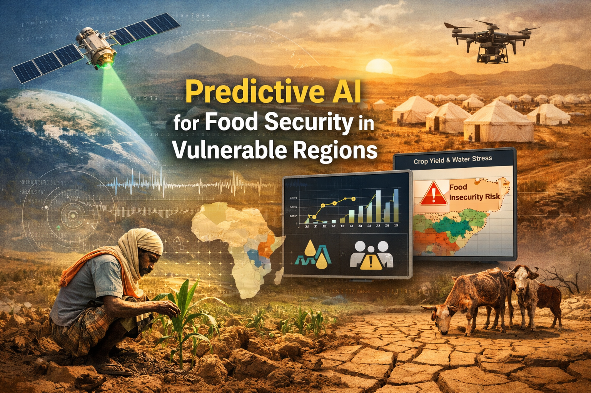

# Predictive AI for Food Security in Vulnerable Regions

Final project for the Building AI course

## Table of Contents
1. [Summary](#summary)
2. [Background](#background)
3. [How is it used?](#how-is-it-used)
4. [Data sources and AI methods](#data-sources-and-ai-methods)
5. [Challenges](#challenges)
6. [What next?](#what-next)
7. [Acknowledgments](#acknowledgments)

## Summary

This project proposes an AI-based decision support system that combines satellite data, climate signals, and socio-economic indicators to predict crop yield, water stress, and food insecurity risk in vulnerable regions such as Somalia. The goal is early warning and preventive action rather than crisis response.

## Background

Food insecurity in many third world countries is driven by a combination of climate variability, water scarcity, fragile agriculture, and limited early warning systems. In Somalia, droughts and failed rainy seasons repeatedly lead to crop failures and humanitarian crises, often detected too late.

This project addresses:
* Unpredictable crop yields due to climate variability
* Water scarcity affecting agriculture and livestock
* Late detection of emerging food insecurity
* Limited local data availability and infrastructure

My personal motivation comes from seeing how preventable crises still cause suffering when early signals exist but are not combined or acted upon. Food insecurity is not only a humanitarian issue but also a data and prediction problem.

## How is it used?

The system is designed as a regional decision-support tool rather than a farmer-facing app.

The AI system runs continuously and produces updated risk assessments at district or regional level. It is used by governments, NGOs, and humanitarian organizations to guide early interventions such as water support, food aid planning, or livelihood assistance.

Typical usage:
1. Satellite data is updated weekly (rainfall, vegetation, soil moisture).
2. The AI model estimates expected crop yield and water stress.
3. These signals are combined with population vulnerability data.
4. The system outputs a food insecurity risk score and confidence level.
5. Decision-makers view results through dashboards or receive alerts.

The system is especially useful:
* During growing seasons
* In drought-prone regions
* When planning preventive humanitarian action

Users include:
* Humanitarian organizations
* Government agencies
* Development planners
* Early warning and food security analysts

## Data sources and AI methods

The system relies primarily on publicly available data sources:

| Data Source | Type |
|------------|------|
| Satellite imagery (Sentinel, MODIS) | Vegetation & land surface |
| CHIRPS | Rainfall estimates |
| SMAP | Soil moisture |
| FAO & IPC data | Food insecurity labels |
| Population datasets | Vulnerability context |

AI methods used:
* Supervised learning for crop yield prediction
* Time-series modeling for climate trends
* Ensemble models combining multiple signals
* Probabilistic risk estimation for food insecurity

The model does not depend on perfect local data and is designed to work with sparse or noisy inputs.

## Challenges

This project does not solve:
* Political or logistical barriers to intervention
* Data gaps caused by conflict or access restrictions
* All ethical concerns related to automated decision-making

Key limitations and considerations:
* Predictions are probabilistic, not guarantees
* AI outputs must support, not replace, human judgment
* Transparency and explainability are essential
* Incorrect predictions could lead to misallocation of resources

Ethically, it is important that such systems are used to assist vulnerable populations, not to reduce accountability or justify inaction.

## What next?

The project could be expanded by:
* Adding mobile-based farmer or field reports
* Improving local calibration with ground truth data
* Integrating market price monitoring
* Developing open dashboards for transparency

To move forward, this would require:
* Collaboration with humanitarian organizations
* Domain expertise in agriculture and food security
* Cloud infrastructure and deployment skills
* Strong governance and ethical oversight

## Acknowledgments

* Inspired by the Elements of AI course by University of Helsinki and Reaktor
* FAO and IPC frameworks for food insecurity analysis
* Public satellite data from ESA and NASA
* No proprietary code, data, or images are used without permission
